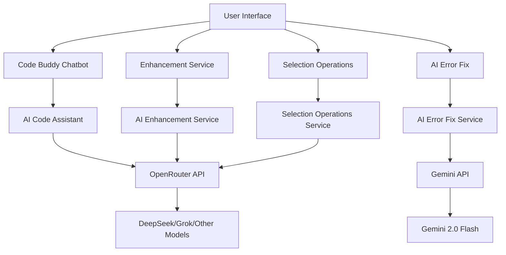

# 🤖 AI Features - Complete Technical Documentation

> GB Coder integrates powerful AI assistance powered by **Google Gemini** and **OpenRouter** to supercharge your web development workflow. This comprehensive guide explains all AI features, their architecture, and how they work behind the scenes.

---

## Table of Contents

1. [System Architecture](#system-architecture)
2. [Code Buddy Chatbot](#code-buddy-chatbot)
3. [AI Code Enhancement](#ai-code-enhancement)
4. [Selection Operations](#selection-operations)
5. [AI Suggestions System](#ai-suggestions-system)
6. [AI Error Fix](#ai-error-fix)
7. [Technical Implementation](#technical-implementation)
8. [Configuration & API Keys](#configuration--api-keys)
9. [Best Practices](#best-practices)

---

## System Architecture

### Overview



### AI Services

| Service | Model | Purpose | API |
|---------|-------|---------|-----|
| **Code Buddy** | DeepSeek/Grok (OpenRouter) | Conversational coding assistant | OpenRouter |
| **Enhancement** | DeepSeek (OpenRouter) | Full code enhancement | OpenRouter |
| **Selection Ops** | DeepSeek (OpenRouter) | Targeted code operations | OpenRouter |
| **Error Fix** | Gemini 2.0 Flash | Runtime error fixing | Gemini |
| **Suggestions** | Gemini Pro (planned) | Real-time code suggestions | Gemini |

---

## Code Buddy Chatbot

### 1. Overview

**Code Buddy** is your AI pair programming partner built into GB Coder,  providing conversational assistance for HTML, CSS, and JavaScript development.

#### Key Features

✅ **Context-Aware Intelligence**: Knows your current HTML, CSS, and JavaScript code  
✅ **File  Attachments**: Upload images, files, or @mention code sections  
✅ **Chat History**: Save and load previous conversations  
✅ **Code Writing Modes**: Direct-to-editor or chatbot display  
✅ **Markdown Formatting**: Rich text responses with syntax highlighting  
✅ **Typewriter Animation**: Smooth code writing to editors  

---

### 2. Architecture

#### Component Stack

```
┌─────────────────────────────────┐
│  GeminiCodeAssistant.tsx        │  UI Component
├─────────────────────────────────┤
│  aiCodeAssistant.ts             │  Service Layer
├─────────────────────────────────┤
│  openRouterService.ts           │  API Gateway
├─────────────────────────────────┤
│  OpenRouter API                 │  AI Provider
│  (DeepSeek/Grok/Llama)          │
└─────────────────────────────────┘
```

#### Data Flow

```typescript
User Input → Chat UI → AI Code Assistant → OpenRouter API → AI Model
                 ↓                                              ↓
         Conversation History ← Response Parser ← JSON Response
                 ↓
         Code Detection → Modal Confirmation → Editor Update
```

---

### 3. Core Capabilities

#### A. Code Generation

**Trigger Words**: `"generate"`, `"create"`, `"make"`, `"build"`, `"write"`, `"give me"`

**Example Requests:**
```
"Create a responsive navbar with dropdown menu"
"Generate CSS grid layout for 3 columns"
"Give me JavaScript for form validation"
```

**Process:**
1. Detects language from request (HTML/CSS/JavaScript)
2. Builds specialized prompt with best practices
3. Sends to OpenRouter AI with reasoning enabled
4. Parses code blocks from response
5. Shows modal: **Write to Editor** or **Show in Chat**

#### B. Code Modification Workflow

**Trigger**: `"modify line X"` or `"change line X"`

**Step-by-Step Flow:**
```
User: "Modify line 15"
    ↓
Bot: "🔧 Code Modification Mode
      Which file? [HTML/CSS/JavaScript]"
    ↓
User: "JavaScript"
    ↓
Bot: "Select action: [1] Insert [2] Replace"
    ↓
User: "2"
    ↓
Bot: "Enter new code:"
    ↓
User: "const result = data.filter(x => x.active);"
    ↓
Bot: "✅ Code Modified Successfully
      Applied replace at line 15 in JAVASCRIPT."
```

#### C. General Assistance

**Capabilities:**
- Debugging help
- Best practice suggestions
- Architecture advice
- Library recommendations
- Performance optimization tips

**Example:**
```
User: "Why is my flexbox not centering items?"
Bot: "I can help with that! Flexbox centering requires both
      align-items and justify-content properties.
      
      For vertical centering: align-items: center
      For horizontal centering: justify-content: center
      
      Here's a complete example:
      ```css
      .container {
          display: flex;
          align-items: center;
          justify-content: center;
          min-height: 100vh;
      }
      ```"
```

---

### 4. Advanced Features

#### File Attachments

**Supported Types:**
- **Images**: Uploaded as base64 data URLs (vision support)
- **Text Files**: Read as plain text

**How to Attach:**
1. Click paperclip icon or drag-and-drop
2. Files appear as chips below input
3. Sent with message to AI for context

**Use Cases:**
- "Generate HTML matching this design" (image attachment)
- "Fix the errors in this code" (file attachment)

#### Code Mentions

**Syntax**: `@html`, `@css`, `@javascript`  (or `@js`)

**Behavior:**
- Automatically attaches current editor code to message
- AI receives code as context file
- Can mention multiple: `@html @css "make them responsive"`

**Example:**
```
User: "@css improve the color scheme"
AI: *receives style.css content*
    "I've analyzed your CSS and here are modern color improvements..."
```

#### Chat History Management

**Features:**
- **Auto-Save**: Every message saved to `localStorage`
- **Session Management**: Up to 20 recent chats stored
- **Session Preview**: First 50 characters displayed
- **Load Session**: Click any previous chat to restore
- **Delete Session**: Remove unwanted history
- **New Chat**: Start fresh (saves current before clearing)

**Storage Location:**
```javascript
localStorage.getItem('codeBuddyHistory')       // Current session
localStorage.getItem('codeBuddyChatSessions')  // All sessions
```

---

### 5. System Prompt

The Code Buddy uses a **comprehensive system prompt** that defines:

#### Expertise Areas
- **HTML5**: Semantic markup, accessibility (WCAG 2.1 AA), SEO
- **CSS3**: Modern layouts (Grid, Flexbox), animations, responsive design
- **JavaScript**: ES6+, async/await, DOM manipulation, error handling

#### Context Awareness
- Knows current HTML, CSS, JavaScript code
- Understands live preview environment
- Can access attached images and files
- Has conversation history for continuity

#### Response Guidelines
- **Code Quality**: Production-ready, well-commented, modern best practices
- **Output Format**: Markdown with syntax-highlighted code blocks
- **Educational Value**: Explains WHY, not just HOW
- **Tone**: Helpful, encouraging, patient

#### Priority Considerations
1. **Correctness**: Code must work as intended
2. **Accessibility**: WCAG 2.1 AA compliance
3. **Performance**: Optimize for speed
4. **Maintainability**: Clean, structured code
5. **Security**: Best practices (XSS prevention, input validation)
6. **Compatibility**: Modern browser support

---

### 6. Code Writing Workflow

#### Modal Confirmation

When AI generates code, a modal appears with two options:

**Option 1: Write to Editors (Section Mode)**
```
Behavior:
1. Clears all existing code (with history save)
2. Writes code with typewriter animation (15 chars/frame)
3. Shows progress for HTML, CSS, JS
4. Creates single undo history entry (not hundreds)
```

**Option 2: Show in Chatbot**
```
Behavior:
1. Displays code in chat with syntax highlighting
2. Each block has Insert and Copy buttons
3. No automatic editor updates
4. User manually inserts desired code
```

#### Typewriter Animation

```typescript
writeCode(code: string, onProgress: (partial, progress) => void, charsPerFrame: 15)

// Example progress:
HTML: ████████░░ 80%
CSS:  ██████████ 100%
JS:   ███░░░░░░░ 30%
```

**Benefits:**
- Visual feedback for user
- Feels like real-time AI coding
- Creates suspense and engagement
- Uses `onCodeUpdateNoHistory` to avoid polluting undo stack

---

## AI Code Enhancement

### 1. Overview

The **AI Enhancement Service** provides comprehensive code improvements for HTML, CSS, and JavaScript with detailed analysis and suggestions.

#### Enhancement Types

| Type | Languages  | Focus Areas |
|------|-----------|-------------|
| **Enhance HTML** | HTML | Semantics, accessibility, SEO, performance |
| **Enhance CSS** | CSS | Layout, theming, performance, responsiveness |
| **Enhance JavaScript** | JavaScript | Modern syntax, async patterns, optimization |

---

### 2. Enhancement Process

#### User Workflow

```
1. Click "AI Suggest" button for HTML/CSS/JS
2. Loading state appears ("Analyzing your code...")
3. AI analyzes code with comprehensive criteria
4. Modal displays: Original vs Enhanced with diff view
5. User reviews changes
6. Click "Apply" to update editor or "Cancel" to dismiss
```

#### Behind the Scenes

```typescript
async enhanceCode(code: string, language: EditorLanguage): Promise<AIEnhancement>

1. buildEnhancementPrompt(code, language)  // Creates specialized prompt
2. openRouterService.sendPrompt(prompt)     // Calls AI
3. parseEnhancementResponse(response)       // Extracts JSON
4. Return AIEnhancement object              // With enhanced code
```

---

### 3. Enhancement Criteria by Language

#### HTML Enhancement Focus

**Semantic Structure & Accessibility** (WCAG 2.1 AA)
- Use semantic elements (`<header>`, `<main>`, `<article>`, etc.)
- Proper heading hierarchy (h1-h6)
- ARIA labels and roles
- `alt` text for images
- Form labels and `aria-describedby`
- Keyboard navigation support
- Color contrast ratios (4.5:1 text, 3:1 large text)

**SEO & Meta Optimization**
- Meta tags (viewport, description, Open Graph)
- Structured data (JSON-LD Schema.org)
- Descriptive titles (50-60 chars)
- Canonical URLs

**Performance**
- Lazy loading (`loading="lazy"`)
- Resource hints (preconnect, prefetch, preload)
- Responsive images (srcset, WebP)
- `async`/`defer` for scripts

**Modern Best Practices**
- Native HTML5 validation attributes
- `<picture>` element for art direction
- `rel="noopener noreferrer"` for external links
- Proper DOCTYPE and lang attributes

#### CSS Enhancement Focus

**Modern Layout Techniques**
- CSS Grid for 2D layouts (with `grid-template-areas`)
- Flexbox for 1D layouts (proper `flex` shorthand)
- Container Queries for component-based responsive design
- `gap` property instead of margins
- `aspect-ratio` for maintaining proportions
- Logical properties (`inline-start`, `block-end`)

**CSS Custom Properties & Theming**
- Comprehensive CSS variables in `:root`
- Dark mode via `@media (prefers-color-scheme: dark)`
- `calc()` and `clamp()` for fluid values
- Cascade layers (`@layer`) for specificity management

**Performance**
- Efficient selectors (avoid deep nesting >3 levels)
- `will-change` for animations (remove after)
- `transform` and `opacity` for GPU acceleration
- `contain` property for layout/paint containment
- `content-visibility` for off-screen optimization

**Responsive Design (Mobile-First)**
- Relative units (`rem`, `em`, `%`, `vw`, `vh`)
- Fluid typography with `clamp(min, preferred, max)`
- `object-fit` and `object-position` for responsive images
- `min()`, `max()`, `clamp()` for fluid sizing

**Accessibility & UX**
- Visible focus states (`:focus-visible`)
- WCAG AA contrast ratios
- `@media (prefers-reduced-motion)` support
- Sufficient touch targets (44x44px minimum)

#### JavaScript Enhancement Focus

**Modern Syntax & Features**
- `const`/`let` instead of `var`
- Arrow functions (mind `this` binding)
- Template literals
- Destructuring (`{name, age} = user`)
- Spread/rest operators
- Optional chaining (`?.`) and nullish coalescing (`??`)
- ES modules (`import`/`export`)
- Array methods (`map`, `filter`, `reduce`, `find`)

**Async Programming**
- `async`/`await` over raw promises
- Proper `try`/`catch` error handling
- `Promise.all()` for parallel operations
- `AbortController` for cancellable async ops

**DOM Manipulation**
- `querySelector`/`querySelectorAll` instead of older methods
- Check element existence before manipulation
- `DOMContentLoaded` event or `defer` attribute
- Event delegation for dynamic elements
- Proper cleanup (`removeEventListener`)

**Performance**
- Debounce expensive operations
- Throttle high-frequency events (scroll, mousemove)
- `DocumentFragment` for batch DOM insertions
- Minimize DOM queries (cache references)
- `requestAnimationFrame` for smooth animations
- Lazy loading
- Web Workers for CPU-intensive tasks

**Security**
- Input validation and sanitization
- Use `textContent` instead of `innerHTML` when possible
- Avoid `eval()` and `Function()` with user input
- XSS prevention
- HTTPS for all API calls

**Error Handling**
- `try`/`catch` blocks for risky operations
- Null/undefined checks before property access
- Network error handling
- Meaningful error messages

---

### 4. Enhancement Response Format

#### JSON Structure

```json
{
  "enhancedCode": "/* Improved code here */",
  "improvements": [
    "Converted var to const/let for better scoping",
    "Added error handling with try/catch blocks",
    "Implemented debouncing for search input",
    "Added accessibility attributes (ARIA labels)",
    "Optimized DOM manipulation with DocumentFragment"
  ],
  "explanation": "The code has been modernized with ES6+ features...",
  "suggestions": [
    {
      "title": "Consider lazy loading",
      "description": "Add Intersection Observer for images",
      "code": "// Example implementation",
      "priority": "medium",
      "category": "performance"
    }
  ]
}
```

#### AIEnhancement Interface

```typescript
interface AIEnhancement {
  id: string;
  language: EditorLanguage;
  originalCode: string;
  enhancedCode: string;
  improvements: string[];        // List of changes made
  explanation: string;            // Why changes were made
  confidence: number;             // 0-100
  suggestions: AICodeSuggestion[];  // Additional recommendations
  timestamp: string;
}
```

---

### 5. Diff Comparison

The enhancement modal shows **side-by-side diff** with:

**Color Coding:**
- 🟢 **Green**: Added lines
- 🔴 **Red**: Removed lines
- 🟡 **Yellow**: Modified lines

**Statistics:**
```
+25 lines added
-12 lines removed
~8 lines modified
```

**Generated by:**
```typescript
generateComparison(original: string, enhanced: string): CodeComparison
```

---

## Selection Operations

### 1. Overview

**Selection Operations** let you right-click on selected code to perform AI-powered targeted operations.

#### Available Operations

| Operation | Purpose | HTML | CSS | JS |
|-----------|---------|------|-----|-----|
| **Explain Selection** | Understand code logic | ✅ | ✅ | ✅ |
| **Find and Fix Issues** | Debug selected code | ✅ | ✅ | ✅ |
| **Optimize Performance** | Improve efficiency | ✅ | ✅ | ✅ |
| **Enhance Visual Design** | Improve UI/UX | ✅ | ✅ | ❌ |

---

### 2. Explain Selected Code

#### What It Does

Provides a **detailed, educational explanation** of what the selected code does, how it works, and key concepts used.

#### Prompt Structure

```
You are an expert {LANGUAGE} developer. Explain the following code snippet 
in a clear and concise way.

Full file context (if available):
```{language}
{full code with selection marked}
```

Selected code to explain:
```{language}
{selected code}
```

Provide a detailed explanation covering:
- What this code does
- How it works
- Key concepts used
- Any important notes or gotchas

Write the explanation in a friendly, educational tone.
```

#### Example

**Selected Code:**
```javascript
const users = await fetch('/api/users').then(r => r.json());
const activeUsers = users.filter(u => u.isActive);
```

**AI Explanation:**
```
This code performs two main operations:

1. **Fetching Data**: Uses the Fetch API to retrieve user data from '/api/users'
   - `await` pauses execution until the promise resolves
   - `.then(r => r.json())` parses the response as JSON

2. **Filtering**: Creates a new array with only active users
   - `filter()` creates a new array without mutating the original
   - Uses arrow function shorthand: `u => u.isActive`

Key Concepts:
- **Async/Await**: Modern promise handling syntax
- **Method Chaining**: Connecting operations for cleaner code
- **Array Filter**: Functional programming pattern

Important Notes:
- Add error handling (try/catch) for network failures
- Consider checking if response.ok before parsing
- Filter is case-sensitive; ensure consistent capitalization
```

---

### 3. Find and Fix Issues

#### What It Does

Analyzes selected code for **bugs, errors, logic flaws, and potential issues**, then suggests fixes.

#### Detection Categories

| Category | Examples |
|----------|----------|
| **Syntax** | Missing semicolons, unclosed brackets |
| **Logic** | Infinite loops, wrong conditions, off-by-one errors |
| **Performance** | Inefficient algorithms, unnecessary reflows |
| **Security** | XSS vulnerabilities, missing input validation |

#### Response Format

```json
{
  "explanation": "Overall analysis of the code",
  "issues": [
    {
      "type": "security",
      "description": "innerHTML with user input creates XSS vulnerability",
      "severity": "high"
    },
    {
      "type": "performance",
      "description": "DOM query inside loop causes repeated reflows",
      "severity": "medium"
    }
  ],
  "suggestedCode": "// Fixed version with issues resolved",
  "confidence": 90
}
```

####Example

**Selected Code (Problematic):**
```javascript
for (let i = 0; i < items.length; i++) {
  document.getElementById('container').innerHTML += `<div>${items[i]}</div>`;
}
```

**AI Analysis:**
```json
{
  "explanation": "This code has performance and security issues",
  "issues": [
    {
      "type": "performance",
      "description": "innerHTML += in loop causes repeated DOM parsing and reflows",
      "severity": "high"
    },
    {
      "type": "security",
      "description": "Directly inserting items[i] without escaping creates XSS risk",
      "severity": "high"
    },
    {
      "type": "logic",
      "description": "Overwrites innerHTML on each iteration, destroying event listeners",
      "severity": "medium"
    }
  ],
  "suggestedCode": "// Fixed version
const fragment = document.createDocumentFragment();
items.forEach(item => {
  const div = document.createElement('div');
  div.textContent = item; // Safe: auto-escapes HTML
  fragment.appendChild(div);
});
document.getElementById('container').appendChild(fragment);",
  "confidence": 95
}
```

---

### 4. Optimize Performance

#### What It Does

Refactors code for **better performance, readability, and modern best practices** without changing functionality.

#### Optimization Areas

**HTML:**
- Add lazy loading
- Use semantic elements
- Optimize resource hints
- Implement responsive images

**CSS:**
- Efficient selectors
- GPU-accelerated animations
- Minimize specificity
- Use CSS variables

**JavaScript:**
- Debounce/throttle
- Batch DOM operations
- Use efficient algorithms
- Remove unnecessary loops

#### Response Format

```json
{
  "explanation": "Why these optimizations improve the code",
  "improvements": [
    "Replaced nested loops with Map for O(n) lookup",
    "Added debouncing to prevent excessive function calls",
    "Batched DOM updates to minimize reflows"
  ],
  "suggestedCode": "// Optimized version",
  "confidence": 90
}
```

#### Example

**Selected Code (Slow):**
```javascript
window.addEventListener('scroll', () => {
  document.querySelector('.header').style.backgroundColor = 
    window.scrollY > 100 ? '#000' : '#fff';
});
```

**Optimized Version:**
```javascript
// Throttle scroll events for better performance
const throttle = (func, limit) => {
  let inThrottle;
  return function() {
    if (!inThrottle) {
      func.apply(this, arguments);
      inThrottle = true;
      setTimeout(() => inThrottle = false, limit);
    }
  }
};

const header = document.querySelector('.header'); // Cache DOM query

const updateHeader = () => {
  // Use class toggle instead of inline styles
  header.classList.toggle('scrolled', window.scrollY > 100);
};

window.addEventListener('scroll', throttle(updateHeader, 100));
```

**Improvements:**
- ✅ Throttling prevents excessive calls (60fps → 10fps = 6x reduction)
- ✅ Cached DOM query (no repeated `querySelector`)
- ✅ CSS class toggle instead of inline styles (better performance)
- ✅ Reusable throttle function

---

### 5. Enhance Visual Design

#### What It Does

Improves **UI/UX aesthetics, accessibility, and modern design** for HTML and CSS (not available for JavaScript).

#### Enhancement Focus

**HTML:**
- Semantic structure
- Accessibility (ARIA, alt text, labels)
- Proper heading hierarchy
- Modern HTML5 elements

**CSS:**
- Modern features (Grid, Flexbox, Custom Properties)
- Responsive design
- Smooth animations
- Visual appeal (shadows, gradients, spacing)

#### Example (CSS)

**Selected Code (Basic):**
```css
.button {
  background: blue;
  color: white;
  padding: 10px;
}
```

**Enhanced Version:**
```css
.button {
  /* Modern color palette */
  background: linear-gradient(135deg, #667eea 0%, #764ba2 100%);
  color: #ffffff;
  
  /* Comfortable spacing */
  padding: 0.75rem 1.5rem;
  
  /* Modern aesthetics */
  border: none;
  border-radius: 0.5rem;
  font-weight: 500;
  box-shadow: 0 4px 6px -1px rgba(0, 0, 0, 0.1);
  
  /* Smooth interactions */
  transition: all 0.3s cubic-bezier(0.4, 0, 0.2, 1);
  cursor: pointer;
  
  /* Accessibility */
  outline-offset: 2px;
}

.button:hover {
  transform: translateY(-2px);
  box-shadow: 0 10px 25px -5px rgba(0, 0, 0, 0.2);
}

.button:focus-visible {
  outline: 2px solid #667eea;
  outline-offset: 2px;
}

/* Reduced motion support */
@media (prefers-reduced-motion: reduce) {
  .button {
    transition: none;
  }
}
```

**Improvements:**
- ✅ Gradient background for visual depth
- ✅ Relative units (`rem`) for scalability
- ✅ Modern `border-radius` and `box-shadow`
- ✅ Smooth transitions with cubic-bezier easing
- ✅ Visible `:focus-visible` state for accessibility
- ✅ `:hover` effect with transform (GPU-accelerated)
- ✅ `prefers-reduced-motion` support

---

## AI Suggestions System

### 1. Overview (Planned Feature)

The **AI Suggestions System** will provide real-time, inline code completion and suggestions as you type (similar to GitHub Copilot or Tabnine).

### 2. Planned Capabilities

- **Inline Completions**: Gray preview text as you type
- **Context-Aware**: Understands your entire project
- **Multi-Line Suggestions**: Complete functions and blocks
- **Accepts with Tab**: Press Tab to accept suggestion

### 3. Current Status

⚠️ **Not yet implemented** – Placeholder for future development using Gemini Pro model.

---

## AI Error Fix

### 1. Overview

The **AI Error Fix** feature provides one-click error resolution for runtime JavaScript errors in the console.

**See [PREVIEW_AND_CONSOLE.md](./PREVIEW_AND_CONSOLE.md#ai-error-fix-feature) for complete documentation.**

### 2. Quick Summary

- **Trigger**: "Fix with AI" button on console errors
- **Model**: Gemini 2.0 Flash Exp
- **Process**: Sends error + code context → AI analyzes → Returns fixed code + explanation
- **UI**: Modal with diff view, confidence meter, and Apply/Cancel buttons

---

## Technical Implementation

### 1. Service Architecture

#### OpenRouter Service

**Purpose**: Gateway to multiple AI models (DeepSeek, Grok, Llama, Claude, etc.)

```typescript
class OpenRouterService {
  async chat(messages, options): Promise<ChatResponse>
  async sendPrompt(prompt, model?, reasoning?): Promise<string>
  testConnection(): Promise<boolean>
  isConfigured(): boolean
}
```

**Features:**
- **Model Selection**: Switch between models easily
- **Reasoning Mode**: Enable extended thinking for complex tasks
- **Streaming**: Real-time response streaming
- **Error Handling**: Graceful fallbacks and retries

#### Service Dependency Map

```
GeminiCodeAssistant ──┐
                      ├──> AICodeAssistant ──┐
                      │                      │
AISuggestButton ──────┼──> AIEnhancementService ──┐
                      │                           │
SelectionOperationsUI ─┴──> SelectionOperationsService ──> OpenRouterService ──> API

EnhancedConsole ──────────> AIErrorFixService ───────────> GeminiService ──> Gemini API
```

---

### 2. Prompt Engineering

#### Template Structure

All prompts follow this pattern:

```
1. Role Definition
   "You are an expert {LANGUAGE} developer..."

2. Task Description
   "Analyze the following code for..."

3. Context Provision
   - Current code
   - Full file context (if available)
   - User's specific request

4. Output Format Specification
   "Provide your response in the following JSON format:
   {
     "enhancedCode": "...",
     "improvements": [...],
     ...
   }"

5. Focus Areas & Criteria
   - HTML: Semantics, accessibility, SEO
   - CSS: Layout, performance, responsiveness
   - JavaScript: Modern syntax, async, optimization

6. Quality Standards
   - Modern best practices (2024)
   - Production-ready code
   - Well-commented
   - Accessible (WCAG 2.1 AA)
```

#### Example: HTML Enhancement Prompt (Excerpt)

```
You are an expert HTML developer. Analyze and enhance the following code with best practices...

**Semantic Structure & Accessibility (WCAG 2.1 AA)**
- Use semantic HTML5 elements (header, nav, main, article, section, aside, footer)
- Implement proper heading hierarchy (h1-h6) without skipping levels
- Add ARIA labels and roles where native semantics fall short
- Include alt attributes for ALL images
- Ensure form inputs have associated labels
- Color contrast ratios (4.5:1 for normal text, 3:1 for large text)

**SEO & Meta Optimization**
- Proper meta tags (viewport, description, Open Graph)
- Structured data using Schema.org (JSON-LD preferred)
- Descriptive title tags (50-60 characters)

**Performance**
- Lazy loading (loading="lazy")
- Resource hints (preconnect, prefetch, preload)
- Responsive images (srcset, WebP with fallbacks)

[...continues with full criteria...]

Original HTML code:
```html
{code}
```

Please provide your response in JSON format:
{
  "enhancedCode": "...",
  "improvements": [...],
  "explanation": "...",
  "suggestions": [...]
}
```

---

### 3. Response Parsing

#### Challenge: LLMs Don't Always Return Perfect JSON

**Common Issues:**
- Wrapped in markdown code blocks
- Contains explanatory text before/after JSON
- Inconsistent formatting
- Trailing commas

**Solution: Multi-Strategy JSON Extraction**

```typescript
private extractJsonFromResponse(response: string): string | null {
  // Method 1: Extract from ```json code blocks
  const jsonBlockMatch = response.match(/```json\s*([\s\S]*?)\s*```/);
  if (jsonBlockMatch) return jsonBlockMatch[1].trim();

  // Method 2: Extract from ``` code blocks (no language)
  const codeBlockMatch = response.match(/```\s*([\s\S]*?)\s*```/);
  if (codeBlockMatch && starts with '{' && ends with '}') 
    return codeBlockMatch[1].trim();

  // Method 3: Find JSON object boundaries
  const jsonMatch = response.match(/\{[\s\S]*\}/);
  if (jsonMatch) return cleanJsonString(jsonMatch[0]);

  // Method 4: Line-by-line brace counting
  // (handles multi-line JSON with text around it)
  
  return null;
}

private cleanJsonString(json: string): string {
  // Remove trailing commas: ,} → }
  cleaned = cleaned.replace(/,(\s*[}\]])/g, '$1');
  
  // Remove markdown backticks
  cleaned = cleaned.replace(/^`+|`+$/g, '');
  
  return cleaned.trim();
}
```

#### Fallback Strategy

If parsing fails:
```typescript
return {
  enhancedCode: originalCode,  // Return unchanged
  improvements: ['Failed to parse AI response - please try again'],
  explanation: 'Error processing response',
  confidence: 0
};
```

---

### 4. Conversation History Management

#### Local Storage Schema

**Current Session:**
```javascript
localStorage.getItem('codeBuddyHistory')
// Array<GeminiChatMessage>
```

**All Sessions:**
```javascript
localStorage.getItem('codeBuddyChatSessions')
// Array<{id, timestamp, messages, preview}>
```

#### History Pruning

```typescript
// Keep max 20 sessions
const updated = [newSession, ...prevSessions].slice(0, 20);
```

#### Context Window Management

```typescript
// Send only last 5 messages to AI for context
conversationHistory: messages.slice(-5)
```

**Why?** Prevents token limit issues while maintaining recent context.

---

## Configuration & API Keys

### 1. Environment Variables

Create `.env` file in project root:

```env
# OpenRouter API (for Code Buddy, Enhancement, Selection Ops)
VITE_OPENROUTER_API_KEY=sk-or-v1-xxxxxxxxxxxxx

# Gemini API (for Error Fix)
VITE_GEMINI_API_KEY=AIzaSyXXXXXXXXX

# Optional: Enable/disable features
VITE_ENABLE_AI_SUGGESTIONS=false
```

### 2. Getting API Keys

#### OpenRouter

1. Visit [openrouter.ai](https://openrouter.ai/)
2. Sign up / Log in
3. Go to "API Keys"
4. Create new key
5. Copy `sk-or-v1-...`

**Recommended Models:**
- **DeepSeek R1** (best value, very capable)
- **Grok 2** (creative, fast)
- **Claude 3.7 Sonnet** (highest quality, expensive)

#### Google Gemini

1. Visit [ai.google.dev](https://ai.google.dev/)
2. Click "Get API Key"
3. Create project
4. Generate key
5. Copy `AIzaSy...`

**Model Used:**
- **Gemini 2.0 Flash Exp** (fast, error fixing)

### 3. Checking Configuration

```typescript
// Code Buddy, Enhancement, Selection Ops
if (openRouterService.isConfigured()) {
  console.log('OpenRouter configured ✓');
}

// Error Fix
if (aiErrorFixService.isConfigured()) {
  console.log('Gemini configured ✓');
}
```

### 4. Testing Connection

```typescript
// Test OpenRouter
await openRouterService.testConnection()
  .then(() => console.log('OpenRouter connection OK'))
  .catch(err => console.error('Connection failed:', err));

// Test Gemini
await aiErrorFixService.testConnection()
  .then(() => console.log('Gemini connection OK'))
  .catch(err => console.error('Connection failed:', err));
```

---

## Best Practices

### 1. Using Code Buddy Effectively

#### DO:
✅ **Be Specific**: "Create a responsive 3-column grid with gap of 2rem"  
✅ **Provide Context**: Use @mentions to share relevant code  
✅ **Upload References**: Attach design mockups for layout requests  
✅ **Iterate**: Ask follow-ups to refine results  
✅ **Explain Intent**: "I want to... because..." helps AI understand goals  

#### DON'T:
❌ **Be Vague**: "Make it better"  
❌ **Skip Context**: Asking about "the button" without sharing HTML  
❌ **Expect Perfection**: AI is an assistant, not a replacement for understanding  
❌ **Blindly Trust**: Always review generated code  

### 2. AI Enhancement Workflow

```
1. Write your initial code
2. Click "AI Suggest" for the section you want to improve
3. Review the diff carefully - understand each change
4. Apply if beneficial, otherwise close
5. Test the enhanced code in live preview
6. Learn from the changes for next time
```

**Learning Opportunity**: Don't just apply changes – read the explanations to improve your own coding.

### 3. Selection Operations Tips

#### When to Use Each Operation

| Situation | Use |
|-----------|-----|
| Don't understand what code does | **Explain Selection** |
| Code not working as expected | **Find and Fix Issues** |
| Code works but feels slow | **Optimize Performance** |
| Layout looks outdated | **Enhance Visual Design** |

#### Providing Context

For best results:
- Select **complete, self-contained** blocks
- Include surrounding code if relevant
- Don't select partial lines

**Good Selection:**
```javascript
function calculateTotal(items) {
  let total = 0;
  for (let i = 0; i < items.length; i++) {
    total += items[i].price * items[i].quantity;
  }
  return total;
}
```

**Bad Selection:**
```javascript
  for (let i = 0; i < items.length; i++) {
    total += items[i].price
```

### 4. Performance Considerations

#### API Rate Limits

**OpenRouter:**
- Varies by model
- Generally high (100,000+ tokens/day for paid tier)

**Gemini:**
- Free tier: 60 requests/minute
- Paid tier: Higher limits

**Best Practice:** Avoid rapid-fire requests – AI needs time to think.

#### Cost Management

**Most Expensive to Least:**
1. Claude 3.7 Sonnet (~$3 per 1M tokens)
2. Grok 2 (~$1 per 1M tokens)
3. DeepSeek R1 (~$0.10 per 1M tokens) ← **Best value**

**Tip**: Start with DeepSeek R1 for day-to-day use!

### 5. Privacy & Security

#### What Gets Sent to AI?

- Your code (HTML, CSS, JavaScript)
- Your chat messages
- Attached files/images
- Error messages (for error fix)

#### What Doesn't Get Sent?

- Other project files
- localStorage data
- Passwords or secrets (unless you paste them – don't!)
- Browsing history

#### Best Practices

- ✅ Use generic variable names in shared code
- ✅ Remove sensitive data before requesting help
- ✅ Don't paste API keys, passwords, or tokens
- ✅ Review code before sending to AI
- ❌ Don't share proprietary business logic you must keep confidential

#### Provider Policies

**OpenRouter**: Passes data to underlying models (DeepSeek, Grok, etc.) – check each model's terms  
**Google Gemini**: Does not use API data for training (as of 2024)

Always review provider terms of service.

---

## Troubleshooting

### Common Issues

**Issue: "OpenRouter API key not configured"**
- **Solution**: Add `VITE_OPENROUTER_API_KEY` to `.env` and restart dev server

**Issue: Code Buddy not responding**
- **Cause**: API quota exceeded or network error
- **Solution**: Check browser console for errors, verify API key balance

**Issue: AI generates wrong language**
- **Cause**: Ambiguous request
- **Solution**: Be explicit: "Give me **CSS** code for..."

**Issue**: Enhancement takes too long**
- **Cause**: Complex code or slow model
- **Solution**: Select smaller code blocks or switch to faster model

**Issue: "Failed to parse AI response"**
- **Cause**: AI returned invalid JSON
- **Solution**: Try again – occasional LLM formatting errors are normal

---

## Keyboard Shortcuts

No specific shortcuts for AI features yet – use mouse/click interface.

**Planned:** `Ctrl+Shift+A` for AI assistant toggle

---

## API Reference

### AICodeAssistant

```typescript
class AICodeAssistant {
  async generateCode(request: string, detectedType?: EditorLanguage): Promise<GeminiChatMessage>
  async sendMessage(request: GeminiChatRequest): Promise<GeminiChatMessage>
  clearHistory(): void
  getHistory(): ConversationHistory[]
  isConfigured(): boolean
}
```

### AIEnhancementService

```typescript
class AIEnhancementService {
  async enhanceCode(code: string, language: EditorLanguage): Promise<AIEnhancement>
  async analyzeCode(code: string, language: EditorLanguage): Promise<AICodeSuggestion[]>
  generateComparison(original: string, enhanced: string): CodeComparison
  isConfigured(): boolean
}
```

### SelectionOperationsService

```typescript
class SelectionOperationsService {
  async explainSelection(code: string, language: EditorLanguage, context?: string): Promise<SelectionOperationResult>
  async debugSelection(code: string, language: EditorLanguage, context?: string): Promise<SelectionOperationResult>
  async optimizeSelection(code: string, language: EditorLanguage, context?: string): Promise<SelectionOperationResult>
  async improveUISelection(code: string, language: 'html'|'css', context?: string): Promise<SelectionOperationResult>
  isConfigured(): boolean
}
```

### AIErrorFixService

See [PREVIEW_AND_CONSOLE.md](./PREVIEW_AND_CONSOLE.md#ai-error-fix-service) for complete API.

---

## Conclusion

GB Coder's AI features transform your development workflow from manual coding to **AI-assisted pair programming**. Master these tools to:

✅ **Code Faster**: Generate boilerplate and complex logic instantly  
✅ **Learn Continuously**: Understand best practices through AI explanations  
✅ **Write Better Code**: Automatic enhancements for accessibility, performance, and security  
✅ **Debug Smarter**: One-click error resolution with detailed explanations  
✅ **Stay Modern**: AI keeps you updated on latest web standards  

**Remember**: AI is a **powerful assistant, not a replacement** for understanding. Use it to augment your skills, not bypass learning.

---

**Document Version**: 2.0  
**Last Updated**: December 8, 2024  
**Related Docs**: [PREVIEW_AND_CONSOLE.md](./PREVIEW_AND_CONSOLE.md), [EDITOR_FEATURES.md](./EDITOR_FEATURES.md)
