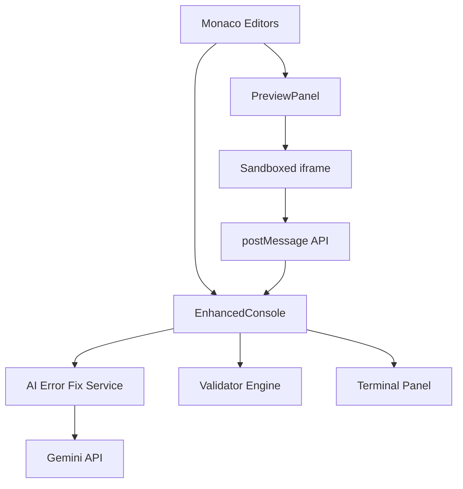
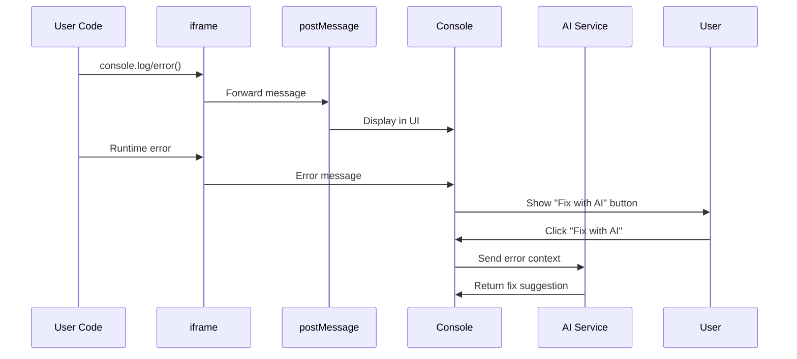
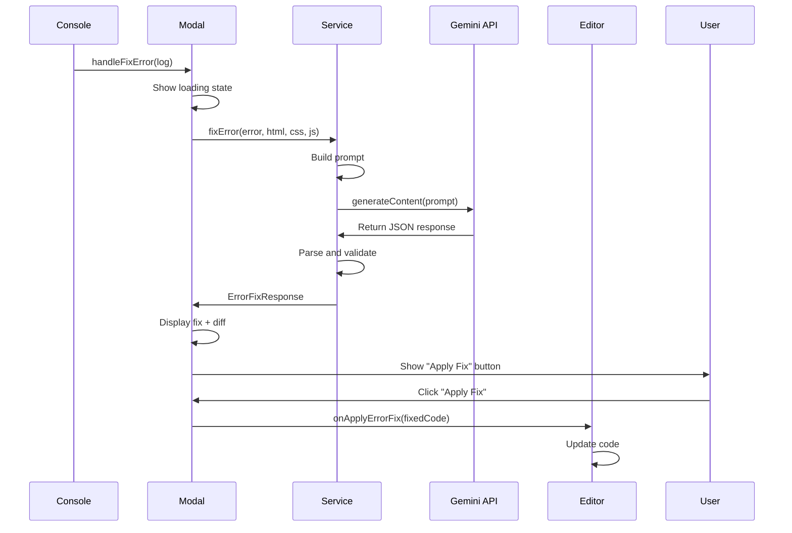

# 👁️ Preview & Console - Complete Technical Documentation

> **Live Preview** and **Enhanced Console** are the core debugging and visualization tools in GB Coder. This comprehensive guide explains their architecture, features, and advanced capabilities.

---

## Table of Contents

1. [System Architecture](#system-architecture)
2. [Live Preview](#live-preview)
3. [Enhanced Console](#enhanced-console)
4. [AI Error Fix Feature](#ai-error-fix-feature)
5. [Technical Deep Dive](#technical-deep-dive)
6. [Best Practices](#best-practices)

---

## System Architecture

### Overview



### Component Relationship

- **PreviewPanel** (`src/components/PreviewPanel.tsx`) - Renders live HTML/CSS/JS in iframe
- **EnhancedConsole** (`src/components/EnhancedConsole.tsx`) - Multi-mode console interface
- **AI Error Fix Service** (`src/services/aiErrorFixService.ts`) - Gemini-powered error resolution
- **Communication**: iframe ↔&#xFE0E; parent window via `postMessage` API

---

## Live Preview

### 1. Core Functionality

The Live Preview panel renders your HTML, CSS, and JavaScript code in real-time using a **sandboxed iframe**.

#### Key Features

✅ **Real-time Updates**: Auto-refreshes as you type (debounced)  
✅ **Security**: Sandboxed execution prevents malicious code from affecting the editor  
✅ **Responsive Testing**: Desktop / Tablet / Mobile viewport simulation  
✅ **External Libraries**: Loads CDN resources from library manager  
✅ **Fullscreen Mode**: Dedicated preview view with ESC key support  
✅ **Manual JS Control**: Optional manual JavaScript execution

---

### 2. Preview Panel Architecture

#### Component Props

```typescript
interface PreviewPanelProps {
  html: string;
  css: string;
  javascript: string;
  onConsoleLog: (log: ConsoleLog) => void;
  autoRunJS?: boolean;        // Default: true
  previewDelay?: number;       // Default: 300ms
}
```

#### View Modes

| Mode | Width | Use Case |
|------|-------|----------|
| **Mobile** | 375px | Phone viewport testing |
| **Tablet** | 768px | Tablet viewport testing |
| **Desktop** | 100% | Full-width preview |
| **Fullscreen** | Full screen | Immersive preview experience |

---

### 3. Content Generation Pipeline

#### Step-by-Step Process

**1. Code Sanitization**

```typescript
const sanitizeCode = (code: string, language: string): string => {
  if (language === 'html') {
    return code
      .replace(/<script\b[^<]*(?:(?!<\/script>)<[^<]*)*<\/script>/gi, '')
      .replace(/on\w+="[^"]*"/gi, '')       // Remove event handlers
      .replace(/javascript:/gi, '')          // Remove javascript: protocols
      .replace(/<iframe\b[^>]*>[\s\S]*?<\/iframe>/gi, ''); // Remove iframes
  } else if (language === 'css') {
    return code
      .replace(/expression\s*\(/gi, '')      // Remove CSS expressions
      .replace(/behavior\s*:/gi, '')         // Remove behavior property
      .replace(/-moz-binding\s*:/gi, '');    // Remove Mozilla binding
  }
  return code;
};
```

**2. HTML Document Construction**

The preview generates a complete HTML5 document:

```html
<!DOCTYPE html>
<html lang="en">
<head>
    <meta charset="UTF-8">
    <meta name="viewport" content="width=device-width, initial-scale=1.0">
    <meta http-equiv="Content-Security-Policy" content="...">
    <title>Preview</title>
    
    <!-- External Libraries (from library manager) -->
    ${externalLibsHTML}
    
    <!-- User's CSS -->
    <style>
        body { 
            margin: 0; 
            padding: 16px; 
            font-family: -apple-system, BlinkMacSystemFont, 'Segoe UI', Roboto, sans-serif;
        }
        ${sanitizedCss}
    </style>
</head>
<body>
    ${sanitizedHtml}
    
    <!-- Console intercept + User's JavaScript -->
    <script>
        // ... (see Console Message Interception)
    </script>
</body>
</html>
```

**3. Console Message Interception**

The preview iframe intercepts all console methods and forwards them to the parent:

```javascript
const sendToParent = (type, message) => {
    if (typeof message === 'string' && message.length < 10000) {
        window.parent.postMessage({
            type: 'console',
            level: type,
            message: message.substring(0, 5000), // Limit message length
            timestamp: new Date().toISOString()
        }, '*');
    }
};

// Override console methods
const secureConsole = {
    log: (...args) => sendToParent('log', args.join(' ')),
    error: (...args) => sendToParent('error', args.join(' ')),
    warn: (...args) => sendToParent('warn', args.join(' ')),
    info: (...args) => sendToParent('info', args.join(' '))
};

console.log = secureConsole.log;
console.error = secureConsole.error;
console.warn = secureConsole.warn;
console.info = secureConsole.info;
```

**4. Runtime Error Capture**

```javascript
window.addEventListener('error', (e) => {
    const message = e.message ? e.message.substring(0, 500) : 'Unknown error';
    sendToParent('error', `${message} at ${e.filename || 'unknown'}:${e.lineno || 'unknown'}`);
});
```

**5. External Library Loading**

```javascript
const waitForLibraries = () => {
    return new Promise((resolve) => {
        if (window.document.readyState === 'complete') {
            resolve();
        } else {
            window.addEventListener('load', resolve);
        }
    });
};

const executeUserCode = async () => {
    try {
        await waitForLibraries();  // Wait for CDN libraries
        
        const startTime = Date.now();
        const MAX_EXECUTION_TIME = 5000; // 5 seconds
        
        // Execute sanitized JavaScript
        eval(sanitizedJs);
    } catch (error) {
        sendToParent('error', error.message || 'Execution error');
    }
};
```

---

### 4. Update Mechanism

#### Debounced Auto-Update

```typescript
useEffect(() => {
  const timeoutId = setTimeout(() => {
    refreshPreview();
  }, previewDelay);  // Default: 300ms
  
  return () => clearTimeout(timeoutId);
}, [html, css, autoRunJS ? javascript : '', previewDelay, manualRunTrigger]);
```

**Behavior:**
- HTML & CSS: **Always** auto-update
- JavaScript: Updates **only** if `autoRunJS` is `true`
- Manual trigger: Use the **Run** button when `autoRunJS` is `false`

#### External Library Change Detection

```typescript
useEffect(() => {
  const handleExternalLibrariesChange = () => refreshPreview();
  
  window.addEventListener('storage', handleExternalLibrariesChange);
  window.addEventListener('external-libraries-updated', handleExternalLibrariesChange);
  
  return () => {
    window.removeEventListener('storage', handleExternalLibrariesChange);
    window.removeEventListener('external-libraries-updated', handleExternalLibrariesChange);
  };
}, []);
```

---

### 5. Security Features

#### iframe Sandbox Attributes

```html
<iframe
  sandbox="allow-scripts allow-same-origin"
  ...
/>
```

**Restrictions:**
- ✅ **allow-scripts**: JavaScript execution permitted
- ✅ **allow-same-origin**: Access to Web APIs (localStorage, etc.)
- ❌ **Blocks**: Form submissions, top navigation, modals, orientation lock

#### Content Security Policy

```html
<meta http-equiv="Content-Security-Policy" 
      content="script-src 'self' 'unsafe-inline' 'unsafe-eval' https: http:; object-src 'none';">
```

**Protection:**
- Allows inline scripts and eval (required for user code)
- Blocks all `<object>` embeds
- Restricts script sources to HTTPS/HTTP

#### Input Validation

- **Message length limits**: Max 10,000 characters
- **Execution timeout**: 5 seconds max
- **Output truncation**: Console messages limited to 5,000 characters

---

### 6. Advanced Features

#### Fullscreen Mode

```typescript
// Activate fullscreen
setViewMode('fullscreen');

// ESC key handler
useEffect(() => {
  const handleEscape = (e: KeyboardEvent) => {
    if (e.key === 'Escape' && viewMode === 'fullscreen') {
      setViewMode('desktop');
    }
  };
  window.addEventListener('keydown', handleEscape);
  return () => window.removeEventListener('keydown', handleEscape);
}, [viewMode]);
```

#### Open in New Tab

```typescript
const openInNewTab = () => {
  const content = generatePreviewContent();
  const blob = new Blob([content], { type: 'text/html' });
  const url = URL.createObjectURL(blob);
  window.open(url, '_blank');
  setTimeout(() => URL.revokeObjectURL(url), 1000);
};
```

---

## Enhanced Console

### 1. Overview

The **Enhanced Console** is a multi-mode debugging interface with 4 distinct modes:

| Mode | Purpose | Key Features |
|------|---------|-------------|
| **Console** | Standard logging | Log filtering, AI error fix |
| **Validator** | Code validation | HTML/CSS/JS syntax checking |
| **Preview** | Isolated testing | Performance metrics, split view |
| **Terminal** | System access | VS Code-style terminal |

---

### 2. Console Mode

#### Features

- **Real-time Logging**: Captures logs from preview iframe
- **Type Filtering**: Filter by log/info/warn/error
- **Timestamp Display**: Shows exact time of each log
- **AI Error Fix**: One-click AI-powered error resolution
- **Copy/Clear**: Clipboard export and log clearing

#### Message Flow



#### Message Interface

```typescript
interface ConsoleLog {
  id: string;
  type: 'log' | 'error' | 'warn' | 'info';
  message: string;
  timestamp: string;
}
```

#### Filter System

```typescript
const filteredBasicLogs = useMemo(() => {
  if (basicFilter === 'all') return logs;
  return logs.filter(log => log.type === basicFilter);
}, [logs, basicFilter]);
```

**Filter Options:**
- `all` - Show all messages
- `log` - Only `console.log()`
- `info` - Only `console.info()`
- `warn` - Only `console.warn()`
- `error` - Only `console.error()`

---

### 3. Validator Mode

#### Validation Engine

The validator performs **static code analysis** on HTML, CSS, and JavaScript.

#### HTML Validation

**Detection Rules:**

1. **Unclosed Tags**
```typescript
const openTags = htmlCode.match(/<([a-z][a-z0-9]*)\b[^>]*>/gi) || [];
const closeTags = htmlCode.match(/<\/([a-z][a-z0-9]*)>/gi) || [];

// Self-closing tags exempt from validation
const selfClosing = ['img', 'br', 'hr', 'input', 'meta', 'link', ...];
```

2. **Missing Required Attributes**
```typescript
// Example:  without alt
if (htmlCode.includes(']+alt=/i)) {
  results.push({
    severity: 'warning',
    message: 'Image tags should have alt attributes for accessibility',
    source: 'html'
  });
}
```

3. **Deprecated Tags**
```typescript
const deprecatedTags = ['center', 'font', 'tt', 'strike', 'big'];
```

#### CSS Validation

**Detection Rules:**

1. **Unclosed Braces**
```typescript
const openBraces = (cssCode.match(/{/g) || []).length;
const closeBraces = (cssCode.match(/}/g) || []).length;

if (openBraces !== closeBraces) {
  results.push({
    severity: 'error',
    message: 'Unclosed CSS braces - missing closing }',
    source: 'css'
  });
}
```

2. **Missing Semicolons**
```typescript
lines.forEach(line => {
  const trimmedLine = line.trim();
  if (trimmedLine && !trimmedLine.endsWith(';') && !trimmedLine.endsWith('{')) {
    results.push({
      severity: 'warning',
      message: `Missing semicolon: ${trimmedLine.substring(0, 30)}...`,
      source: 'css'
    });
  }
});
```

#### JavaScript Validation

**Detection Rules:**

1. **Syntax Errors**
```typescript
try {
  new Function(jsCode);  // Attempt to parse
} catch (error) {
  results.push({
    severity: 'error',
    message: `Syntax error: ${error.message}`,
    source: 'js'
  });
}
```

2. **Best Practice Warnings**
```typescript
// Use of 'var' instead of 'let'/'const'
if (jsCode.includes('var ')) {
  results.push({
    severity: 'warning',
    message: 'Consider using let or const instead of var',
    source: 'js'
  });
}

// Use of '==' instead of '==='
if (jsCode.match(/==(?!=)/g)) {
  results.push({
    severity: 'warning',
    message: 'Consider using === instead of == for strict equality',
    source: 'js'
  });
}
```

#### Auto-Validation

```typescript
useEffect(() => {
  if (autoValidate && activeMode === 'validator') {
    const timer = setTimeout(runValidation, 500);  // Debounce
    return () => clearTimeout(timer);
  }
}, [html, css, javascript, autoValidate, activeMode, runValidation]);
```

**Behavior:**
- **Enabled by default**: Toggle via checkbox
- **Debounced**: 500ms delay after typing stops
- **Manual trigger**: "Validate" button for on-demand checks

#### Result Display

```typescript
interface ValidationResult {
  line?: number;
  column?: number;
  severity: 'error' | 'warning' | 'info';
  message: string;
  source: 'html' | 'css' | 'js';
}
```

**Visual Indicators:**
- 🔴 **Error**: Red border, critical issues
- 🟡 **Warning**: Yellow border, best practice violations
- 🔵 **Info**: Blue border, suggestions

---

### 4. Preview Console Mode

#### Features

- **Isolated Execution**: Separate iframe from main preview
- **Performance Metrics**: Load time, memory usage, DOM nodes
- **Network Monitoring**: Fetch API request tracking
- **Split View**: Console output + live preview side-by-side

#### Performance Metrics

```typescript
interface PerformanceMetrics {
  loadTime: number;        // Page load time (ms)
  memoryUsage: number;     // Heap size (bytes)
  domNodes: number;        // Total DOM elements
  executionTime: number;   // Script execution time
}
```

**Data Collection:**

```javascript
window.addEventListener('load', function() {
  const loadTime = performance.now();
  window.parent.postMessage({
    type: 'performance',
    data: {
      loadTime: loadTime,
      memoryUsage: performance.memory ? performance.memory.usedJSHeapSize : 0,
      domNodes: document.querySelectorAll('*').length
    }
  }, '*');
});
```

#### Network Request Monitoring

```javascript
const originalFetch = window.fetch;
window.fetch = function(...args) {
  const startTime = Date.now();
  return originalFetch.apply(this, args).then(response => {
    const duration = Date.now() - startTime;
    window.parent.postMessage({
      type: 'network',
      data: {
        url: args[0],
        method: 'GET',
        status: response.status,
        duration: duration
      }
    }, '*');
    return response;
  });
};
```

---

### 5. Terminal Mode

Renders the **TerminalConsolePanel** component with VS Code-style terminal functionality.

See [TERMINAL_GUIDE.md](./TERMINAL_GUIDE.md) for complete documentation.

---

## AI Error Fix Feature

### 1. Overview

The **"Fix with AI"** button appears next to every error in the console, allowing **one-click AI-powered debugging**.

#### Visual Flow

```
[ERROR] Cannot read property 'value' of null
                                    [✨ Fix with AI]
                                          ↓
                            [AI Error Fix Modal Opens]
                                          ↓
                    [Gemini Analyzes Error + Code Context]
                                          ↓
                    [Display Fixed Code + Explanation]
                                          ↓
                        [User Clicks "Apply Fix"]
                                          ↓
                    [Editors Updated with Fixed Code]
```

---

### 2. Architecture

#### Components

1. **Trigger Button** (`EnhancedConsole.tsx`)
2. **AI Service** (`aiErrorFixService.ts`)
3. **Modal UI** (`AIErrorFixModal.tsx`)

#### Data Flow



---

### 3. AI Error Fix Service

#### Service Class

```typescript
export class AIErrorFixService {
  private model = genAI.getGenerativeModel({ 
    model: 'gemini-2.0-flash-exp' 
  });

  async fixError(
    errorMessage: string,
    html: string,
    css: string,
    javascript: string
  ): Promise<ErrorFixResponse>
}
```

#### Prompt Engineering

The service uses a **comprehensive system prompt** with:

**1. Context Setting**
```
You are an expert JavaScript debugger integrated into GB Coder.
Environment: Browser sandbox with standard DOM APIs.
```

**2. Debugging Methodology**
- Root cause analysis (not just symptoms)
- Conservative fix approach (minimal changes)
- Educational explanations

**3. Common Error Patterns**
- Null/Undefined references
- DOM timing issues
- Scope and variable problems
- Type errors
- Event listener issues
- Async/Promise errors

**4. Response Format**
```json
{
  "fixedHtml": "...",
  "fixedCss": "...",
  "fixedJavascript": "...",
  "explanation": "...",
  "confidence": 85,
  "changesApplied": {
    "html": false,
    "css": false,
    "javascript": true
  }
}
```

#### Example Prompt

```
ERROR MESSAGE:
Cannot read property 'value' of null

CURRENT CODE:

JavaScript:
```javascript
const input = document.getElementById('myInput');
console.log(input.value);
```

TASK:
Analyze the error and provide fixed code with explanation.
Format response as JSON with fixedJavascript, explanation, and confidence.
```

#### Response Parsing

```typescript
private parseErrorFixResponse(response: string, originalError: string): ErrorFixResponse {
  // Extract JSON from response (handles markdown code blocks)
  let jsonString = this.extractJsonFromResponse(response);
  
  const parsed = JSON.parse(jsonString);
  
  return {
    id: Date.now().toString(),
    originalError,
    fixedHtml: parsed.fixedHtml || '',
    fixedCss: parsed.fixedCss || '',
    fixedJavascript: parsed.fixedJavascript || '',
    explanation: parsed.explanation || 'The error has been fixed.',
    confidence: parsed.confidence || 75,
    changesApplied: parsed.changesApplied || {
      html: false,
      css: false,
      javascript: true,
    },
    timestamp: new Date().toISOString(),
  };
}
```

#### Error Handling

```typescript
try {
  const result = await this.model.generateContent(prompt);
  return this.parseErrorFixResponse(result.response.text(), errorMessage);
} catch (error) {
  if (error.message.includes('API key')) {
    throw new Error('Invalid API key. Please check your Gemini API configuration.');
  } else if (error.message.includes('quota')) {
    throw new Error('API quota exceeded. Please try again later.');
  } else if (error.message.includes('model')) {
    throw new Error('Model not available. Service may be temporarily unavailable.');
  }
  throw new Error(`Failed to fix error: ${error.message}`);
}
```

---

### 4. AI Error Fix Modal

#### Modal States

**Loading State**
```tsx
{isLoading && (
  <div className="flex-1 flex items-center justify-center">
    <div className="text-center">
      <Sparkles className="w-12 h-12 text-blue-400 animate-pulse mx-auto mb-4" />
      <p className="text-gray-300 text-lg">AI is analyzing your error...</p>
      <p className="text-gray-500 text-sm mt-2">This may take a few seconds</p>
    </div>
  </div>
)}
```

**Success State**

Displays:
1. **Original Error** (red alert box)
2. **Explanation** (blue info box with confidence meter)
3. **Code Diff Tabs** (HTML/CSS/JavaScript)
4. **Change Statistics** (lines added/removed/modified)
5. **Apply/Cancel Buttons**

#### Code Diff Display

```typescript
const htmlComparison = useMemo(() => {
  if (!fixResponse || !fixResponse.changesApplied.html) return null;
  return aiEnhancementService.generateComparison(
    originalCode.html, 
    fixResponse.fixedHtml
  );
}, [fixResponse, originalCode.html]);
```

**Diff Format:**

```tsx
<div className={
  diff.type === 'addition' 
    ? 'bg-green-500 bg-opacity-10 border-l-2 border-green-500'
  : diff.type === 'deletion'
    ? 'bg-red-500 bg-opacity-10 border-l-2 border-red-500'
    : 'bg-yellow-500 bg-opacity-10 border-l-2 border-yellow-500'
}>
  <span>{diff.lineNumber}</span>
  <span>{diff.type === 'addition' ? '+' : diff.type === 'deletion' ? '-' : '~'}</span>
  <code>{diff.content}</code>
</div>
```

**Visual Indicators:**
- 🟢 **Green**: Added lines
- 🔴 **Red**: Removed lines
- 🟡 **Yellow**: Modified lines

#### Confidence Meter

```tsx
<div className="w-24 h-2 bg-gray-700 rounded-full overflow-hidden">
  <div
    className="h-full bg-gradient-to-r from-blue-500 to-green-500"
    style={{ width: `${fixResponse.confidence}%` }}
  />
</div>
<span className="text-blue-400 text-xs font-semibold">
  {fixResponse.confidence}%
</span>
```

**Confidence Levels:**
- **90-100%**: High confidence (likely correct)
- **70-89%**: Medium confidence (review recommended)
- **Below 70%**: Low confidence (manual review required)

#### Apply Fix Handler

```typescript
const handleApply = () => {
  if (!fixResponse) return;
  onApplyFix(
    fixResponse.fixedHtml, 
    fixResponse.fixedCss, 
    fixResponse.fixedJavascript
  );
  onClose();
};
```

**What Happens:**
1. Modal closes
2. Editors update with fixed code
3. Preview auto-refreshes
4. Error should disappear from console

---

### 5. Real-World Example

#### Scenario: Null Reference Error

**User's Code** (JavaScript):
```javascript
const button = document.getElementById('submit');
button.addEventListener('click', () => {
  console.log('Clicked!');
});
```

**Console Error:**
```
Cannot read property 'addEventListener' of null
```

**User Action:** Clicks **"Fix with AI"**

#### AI Analysis Process

**1. Gemini Receives:**
- Error message: `Cannot read property 'addEventListener' of null`
- HTML code: (empty or doesn't contain `<button id="submit">`)
- CSS code: (irrelevant)
- JavaScript code: (above)

**2. AI Diagnosis:**
- Root cause: Script runs before DOM is ready
- Element `#submit` does not exist when script executes

**3. AI Response:**
```json
{
  "fixedHtml": "",
  "fixedCss": "",
  "fixedJavascript": "document.addEventListener('DOMContentLoaded', () => {\n  const button = document.getElementById('submit');\n  if (button) {\n    button.addEventListener('click', () => {\n      console.log('Clicked!');\n    });\n  } else {\n    console.warn('Button with id \"submit\" not found');\n  }\n});",
  "explanation": "The error occurred because the script tried to access the button element before the DOM was fully loaded. The fix wraps the code in a DOMContentLoaded event listener to ensure the DOM is ready. Additionally, a null check (if statement) prevents errors if the element doesn't exist, with a helpful warning message.",
  "confidence": 95,
  "changesApplied": {
    "html": false,
    "css": false,
    "javascript": true
  }
}
```

**4. Modal Display:**

**Explanation Box:**
```
The error occurred because the script tried to access the button element 
before the DOM was fully loaded. The fix wraps the code in a DOMContentLoaded 
event listener to ensure the DOM is ready. Additionally, a null check 
(if statement) prevents errors if the element doesn't exist.

Confidence: ████████████████░░ 95%
```

**JavaScript Diff:**
```diff
+ 1  document.addEventListener('DOMContentLoaded', () => {
  2    const button = document.getElementById('submit');
+ 3    if (button) {
  4      button.addEventListener('click', () => {
  5        console.log('Clicked!');
  6      });
+ 7    } else {
+ 8      console.warn('Button with id "submit" not found');
+ 9    }
+10  });
```

**Statistics:**
- ✅ +7 lines added
- ❌ 0 lines removed
- ⚠️ 0 lines modified

**5. User Clicks "Apply Fix"**

**Result:**
- JavaScript editor updates with fixed code
- Preview refreshes
- Error disappears from console
- Warning may appear if button element still missing in HTML

---

## Technical Deep Dive

### 1. Message Communication Protocol

#### postMessage API

**Sender (iframe):**
```javascript
window.parent.postMessage({
  type: 'console',
  level: 'error',
  message: 'Error message here',
  timestamp: new Date().toISOString()
}, '*');
```

**Receiver (parent window):**
```typescript
useEffect(() => {
  const handleMessage = (event: MessageEvent) => {
    if (event.data.type === 'console') {
      const log: ConsoleLog = {
        id: Date.now().toString(),
        type: event.data.level,
        message: event.data.message,
        timestamp: event.data.timestamp,
      };
      onConsoleLog(log);
    }
  };
  
  window.addEventListener('message', handleMessage);
  return () => window.removeEventListener('message', handleMessage);
}, [onConsoleLog]);
```

#### Security Considerations

- **Origin validation**: Use specific origins instead of `'*'` in production
- **Message size limits**: Prevent memory exhaustion
- **Content sanitization**: Escape HTML entities in messages

---

### 2. Performance Optimization

#### Debouncing Strategy

```typescript
// Preview updates
const PREVIEW_DELAY = 300ms;  // Balance between responsiveness and performance

// Validation
const VALIDATION_DELAY = 500ms;  // Longer delay for expensive operations
```

#### Memory Management

**iframe Refresh:**
- New `srcdoc` assignment recreates iframe DOM
- Previous DOM is garbage collected
- Prevents memory leaks from long sessions

**Message Limits:**
- Total message length: 10,000 characters
- Individual log length: 5,000 characters
- Prevents browser memory issues

#### Execution Timeout

```javascript
const MAX_EXECUTION_TIME = 5000; // 5 seconds

const checkTimeout = () => {
  if (Date.now() - startTime > MAX_EXECUTION_TIME) {
    throw new Error('Script execution timeout');
  }
};
```

---

### 3. Error Categories

#### Preview Errors

| Type | Cause | Detection | Fix |
|------|-------|-----------|-----|
| **Syntax Error** | Invalid JS syntax | `window.onerror` | AI suggests syntax correction |
| **Reference Error** | Undefined variable | Runtime exception | Add variable declaration |
| **Type Error** | Wrong data type | Method call on non-object | Type validation |
| **DOM Error** | Element not found | `getElementById` returns null | DOM ready check |
| **Network Error** | Failed fetch | Promise rejection | Error handling |

#### Validation Errors

| Severity | Impact | Auto-Fix | User Action |
|----------|--------|----------|-------------|
| **Error** | Code won't work | No | Must fix manually or with AI |
| **Warning** | Best practice violation | No | Should fix for quality |
| **Info** | Suggestion | No | Optional improvement |

---

## Best Practices

### 1. Preview Panel

#### Code Organization

✅ **DO:**
- Place JavaScript at the end of HTML
- Use `DOMContentLoaded` for initialization
- Add `defer` attribute to script tags
- Test in all viewport modes

❌ **DON'T:**
- Rely on external resources without fallbacks
- Use infinite loops (will timeout)
- Access parent window (sandbox violation)
- Ignore console errors

#### Performance Tips

```javascript
// Good: Efficient DOM manipulation
const fragment = document.createDocumentFragment();
items.forEach(item => {
  const div = document.createElement('div');
  div.textContent = item;
  fragment.appendChild(div);
});
document.body.appendChild(fragment);

// Bad: Multiple reflows
items.forEach(item => {
  const div = document.createElement('div');
  div.textContent = item;
  document.body.appendChild(div); // Reflow on each iteration
});
```

---

### 2. Console Usage

#### Effective Debugging

```javascript
// Use descriptive labels
console.log('User data:', userData);

// Log object properties
console.log({ name, age, email });

// Use console methods appropriately
console.info('App initialized');
console.warn('Deprecated API used');
console.error('Network request failed');
```

#### Error Handling

```javascript
// Always handle errors
async function fetchData() {
  try {
    const response = await fetch('/api/data');
    if (!response.ok) {
      throw new Error(`HTTP error! status: ${response.status}`);
    }
    const data = await response.json();
    console.log('Data fetched:', data);
    return data;
  } catch (error) {
    console.error('Fetch failed:', error.message);
    return null;
  }
}
```

---

### 3. AI Error Fix

#### When to Use

✅ **Best For:**
- Runtime errors (null references, undefined variables)
- Timing issues (DOM not ready)
- Async/await problems
- Event listener errors

⚠️ **Review Required:**
- Critical business logic
- Security-sensitive code
- Complex algorithms
- Database operations

❌ **Not Suitable For:**
- Architectural decisions
- Design pattern selection
- Performance optimization (use Validator)

#### After Applying Fix

1. **Understand the Fix**: Read the explanation
2. **Test Thoroughly**: Verify no new issues introduced
3. **Learn**: Understand why the error occurred
4. **Prevent**: Apply lessons to future code

---

### 4. Validator Best Practices

#### HTML

```html
<!-- Good -->

<a href="/about">About Us</a>

<!-- Bad (Validator will catch) -->
  <!-- Missing alt -->
<a>About Us</a>       <!-- Missing href -->
```

#### CSS

```css
/* Good */
.container {
  display: flex;
  justify-content: center;
}

/* Bad (Validator will catch) */
.container {
  display: flex
  justify-content: center;  /* Missing semicolon */
}  /* Proper closing */
```

#### JavaScript

```javascript
// Good
const API_URL = 'https://api.example.com';
let counter = 0;

if (value === null) {
  console.warn('Value is null');
}

// Bad (Validator will catch)
var API_URL = 'https://api.example.com';  // Use const
let counter = 0

if (value == null) {  // Use ===
  console.warn('Value is null')
}
```

---

## Troubleshooting

### Common Issues

**Issue: Preview not updating**
- **Cause**: JavaScript error blocking execution
- **Solution**: Check console for errors, fix or use AI

**Issue: Console empty despite errors**
- **Cause**: postMessage blocked by CSP or sandbox
- **Solution**: Verify iframe sandbox attributes

**Issue: Validator showing false positives**
- **Cause**: Complex or minified code
- **Solution**: Disable auto-validate, use manual checks

**Issue: AI fix not applying**
- **Cause**: API key invalid or quota exceeded
- **Solution**: Check API configuration in `.env`

**Issue: Performance metrics showing 0**
- **Cause**: Preview mode not activated
- **Solution**: Switch to Preview Console mode and click "Run"

---

## Keyboard Shortcuts

| Shortcut | Action | Mode |
|----------|--------|------|
| `Ctrl+Enter` | Run preview code | Preview Console |
| `ESC` | Exit fullscreen | Preview Panel |
| `Ctrl+L` | Clear console | All modes |
| `Ctrl+K` | Focus console | All modes |

---

## API Reference

### PreviewPanel

```typescript
interface PreviewPanelProps {
  html: string;
  css: string;
  javascript: string;
  onConsoleLog: (log: ConsoleLog) => void;
  autoRunJS?: boolean;
  previewDelay?: number;
}
```

### EnhancedConsole

```typescript
interface EnhancedConsoleProps {
  logs: ConsoleLog[];
  onClear: () => void;
  html: string;
  css: string;
  javascript: string;
  onApplyErrorFix?: (
    fixedHtml: string, 
    fixedCss: string, 
    fixedJavascript: string
  ) => void;
  className?: string;
}
```

### AIErrorFixService

```typescript
class AIErrorFixService {
  async fixError(
    errorMessage: string,
    html: string,
    css: string,
    javascript: string
  ): Promise<ErrorFixResponse>;
  
  isConfigured(): boolean;
  async testConnection(): Promise<boolean>;
}
```

### Types

```typescript
interface ErrorFixResponse {
  id: string;
  originalError: string;
  fixedHtml: string;
  fixedCss: string;
  fixedJavascript: string;
  explanation: string;
  confidence: number;
  changesApplied: {
    html: boolean;
    css: boolean;
    javascript: boolean;
  };
  timestamp: string;
}

interface ValidationResult {
  line?: number;
  column?: number;
  severity: 'error' | 'warning' | 'info';
  message: string;
  source: 'html' | 'css' | 'js';
}
```

---

## Conclusion

The Preview & Console system in GB Coder provides a comprehensive debugging environment with:

✅ Real-time preview with responsive testing  
✅ Multi-mode console (logging, validation, preview, terminal)  
✅ AI-powered error fixing with explanations  
✅ Code validation with auto-detection  
✅ Performance monitoring and network tracking  

**Master these tools to become a more efficient developer!**

---

**Document Version**: 2.0  
**Last Updated**: December 8, 2024  
**Related Docs**: [TERMINAL_GUIDE.md](./TERMINAL_GUIDE.md), [AI_FEATURES.md](./AI_FEATURES.md)
