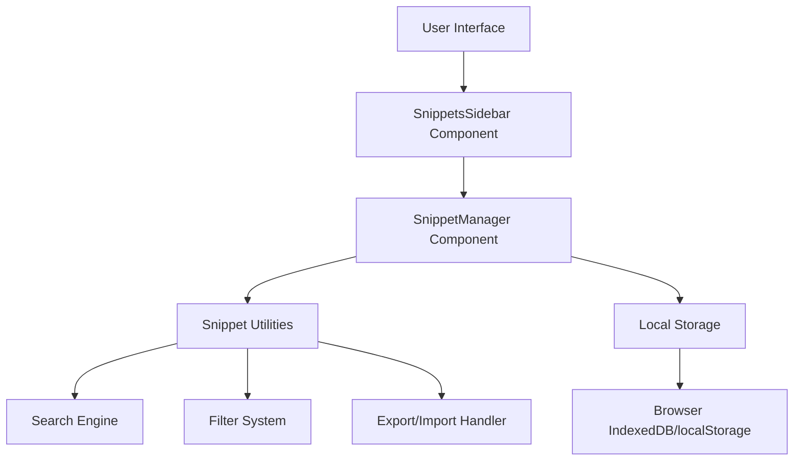
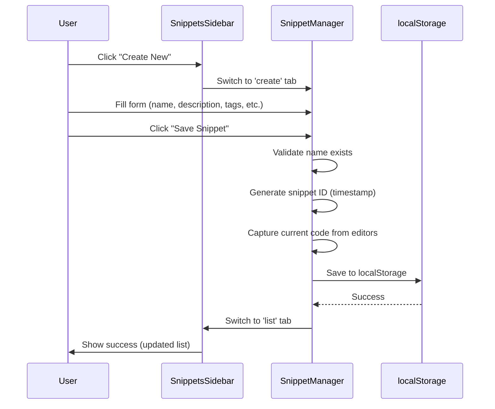
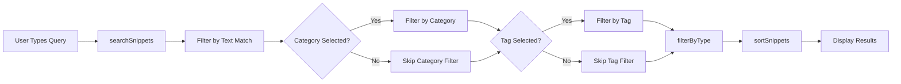
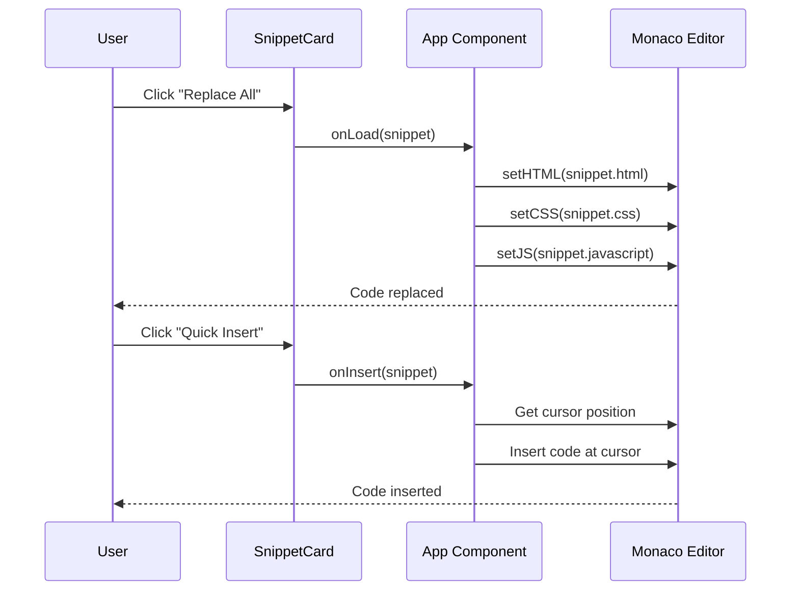

# GB Coder Snippet System - Comprehensive Guide

## Table of Contents
1. [Overview](#overview)
2. [System Architecture](#system-architecture)
3. [Data Structure](#data-structure)
4. [Frontend Components](#frontend-components)
5. [Backend Server](#backend-server)
6. [Storage Mechanism](#storage-mechanism)
7. [Snippet Lifecycle](#snippet-lifecycle)
8. [Advanced Features](#advanced-features)
9. [API Reference](#api-reference)
10. [Best Practices](#best-practices)

---

## Overview

The GB Coder Snippet System is a powerful code management feature that allows developers to save, organize, and reuse HTML, CSS, and JavaScript code snippets. The system provides a professional sidebar interface with comprehensive search, filter, and categorization capabilities.

### Key Features
- ✨ **Multi-format Support**: Save full pages or individual HTML/CSS/JavaScript snippets
- 🔍 **Advanced Search**: Search by name, description, tags, or content
- 🏷️ **Smart Categorization**: Organize snippets with categories and tags
- 📤 **Import/Export**: Share snippets via JSON files
- 🎯 **Quick Insert**: One-click snippet insertion into editor
- 👁️ **Multiple Views**: List and Grid layout options
- 🌟 **Recommended Snippets**: Pre-built templates for common patterns
- 🔐 **Privacy Control**: Public/Private snippet scoping

---

## System Architecture



### Component Hierarchy

1. **SnippetsSidebar.tsx** - Top-level sidebar container
   - Manages sidebar visibility and state
   - Provides tab navigation (My Snippets / Create New)
   - Handles backdrop and animations

2. **SnippetManager.tsx** - Core logic component
   - Manages snippet CRUD operations
   - Handles search, filter, and sort operations
   - Provides both inline and sidebar view modes

3. **snippetUtils.ts** - Utility functions
   - Export/Import JSON functionality
   - Search and filter algorithms
   - Type detection and migration
   - Recommended snippets library

---

## Data Structure

### CodeSnippet Interface

```typescript
export interface CodeSnippet {
  // Core Identification
  id: string;                    // Unique identifier (timestamp-based)
  name: string;                  // Display name of the snippet
  
  // Code Content
  html: string;                  // HTML code
  css: string;                   // CSS code
  javascript: string;            // JavaScript code
  
  // Metadata
  createdAt: string;             // ISO 8601 timestamp of creation
  updatedAt?: string;            // ISO 8601 timestamp of last update
  description?: string;          // Optional description
  
  // Organization
  tags?: string[];               // Array of tag strings for filtering
  category?: string;             // Category name (e.g., "Layouts", "Components")
  
  // Classification
  type?: SnippetType;           // 'full' | 'html' | 'css' | 'javascript'
  scope?: SnippetScope;         // 'private' | 'public'
}
```

### Snippet Types

```typescript
type SnippetType = 'full' | 'html' | 'css' | 'javascript';

// Type Detection Logic:
// - 'full': Contains HTML, CSS, AND JavaScript
// - 'html': Contains only HTML
// - 'css': Contains only CSS
// - 'javascript': Contains only JavaScript
// - 'full' (default): Mixed content (2 out of 3 languages)
```

### Snippet Scope

```typescript
type SnippetScope = 'private' | 'public';

// Scope Definitions:
// - 'private': Personal snippets (default)
// - 'public': Shareable snippets (can be exported)
```

---

## Frontend Components

### 1. SnippetsSidebar Component

**Location**: `src/components/SnippetsSidebar.tsx`

**Purpose**: Main UI container for the snippet management interface

#### Props Interface
```typescript
interface SnippetsSidebarProps {
  isOpen: boolean;
  onClose: () => void;
  snippets: CodeSnippet[];
  onSave: (name, html, css, javascript, description?, tags?, category?, type?, scope?) => void;
  onLoad: (snippet: CodeSnippet) => void;
  onInsert: (snippet: CodeSnippet) => void;
  onDelete: (id: string) => void;
  onUpdate: (id: string, updates: Partial<CodeSnippet>) => void;
  currentCode: { html: string; css: string; javascript: string; };
}
```

#### Key Features
- **Sliding Animation**: Smooth slide-in from right with cubic-bezier easing
- **Backdrop**: Semi-transparent overlay with blur effect
- **Tab Navigation**: Switch between "My Snippets" and "Create New"
- **Responsive Design**: Full-screen on mobile, 400px width on desktop

#### State Management
```typescript
const [activeTab, setActiveTab] = useState<'list' | 'create'>('list');
```

---

### 2. SnippetManager Component

**Location**: `src/components/SnippetManager.tsx`

**Purpose**: Core business logic for snippet operations

#### View Modes

**Sidebar Mode** (`viewMode='sidebar'`)
- Integrated into `SnippetsSidebar`
- Tab-based navigation
- Full-height scrolling

**Inline Mode** (`viewMode='inline'`)
- Embedded in main application
- Modal-based creation/editing
- Collapsible snippet list

#### Key State Variables

```typescript
// UI State
const [isModalOpen, setIsModalOpen] = useState(false);
const [showSnippets, setShowSnippets] = useState(false);
const [editingSnippet, setEditingSnippet] = useState<CodeSnippet | null>(null);

// Search & Filter
const [searchQuery, setSearchQuery] = useState('');
const [sortBy, setSortBy] = useState<'name' | 'date' | 'updated'>('updated');
const [selectedCategory, setSelectedCategory] = useState('all');
const [typeFilter, setTypeFilter] = useState<SnippetType | 'all'>('all');
const [selectedTag, setSelectedTag] = useState('all');

// View Options
const [viewLayout, setViewLayout] = useState<'list' | 'grid'>('list');
const [showRecommended, setShowRecommended] = useState(false);

// Form State
const [snippetName, setSnippetName] = useState('');
const [snippetDescription, setSnippetDescription] = useState('');
const [snippetTags, setSnippetTags] = useState('');
const [snippetCategory, setSnippetCategory] = useState('');
const [snippetType, setSnippetType] = useState<SnippetType>('full');
const [snippetScope, setSnippetScope] = useState<SnippetScope>('private');
```

#### Search Algorithm

The search function performs fuzzy matching across multiple fields:

```typescript
export const searchSnippets = (snippets: CodeSnippet[], query: string): CodeSnippet[] => {
  if (!query.trim()) return snippets;
  
  const searchTerm = query.toLowerCase();
  
  return snippets.filter(snippet =>
    snippet.name.toLowerCase().includes(searchTerm) ||
    snippet.description?.toLowerCase().includes(searchTerm) ||
    snippet.tags?.some(tag => tag.toLowerCase().includes(searchTerm)) ||
    snippet.category?.toLowerCase().includes(searchTerm) ||
    snippet.html.toLowerCase().includes(searchTerm) ||
    snippet.css.toLowerCase().includes(searchTerm) ||
    snippet.javascript.toLowerCase().includes(searchTerm)
  );
};
```

#### Filter Pipeline

Snippets are filtered through multiple stages:

1. **Search Filter**: Text-based fuzzy search
2. **Category Filter**: Filter by selected category
3. **Tag Filter**: Filter by selected tag
4. **Type Filter**: Filter by snippet type (full/html/css/javascript)
5. **Sort**: Sort by name/date/updated timestamp

```typescript
const filteredSnippets = useMemo(() => {
  let filtered = searchSnippets(snippets, searchQuery);
  
  if (selectedCategory !== 'all') {
    filtered = filtered.filter(snippet => snippet.category === selectedCategory);
  }
  
  if (selectedTag !== 'all') {
    filtered = filtered.filter(snippet => snippet.tags?.includes(selectedTag));
  }
  
  filtered = filterByType(filtered, typeFilter);
  
  return sortSnippets(filtered, sortBy);
}, [snippets, searchQuery, selectedCategory, selectedTag, sortBy, typeFilter]);
```

---

### 3. Snippet Utilities

**Location**: `src/utils/snippetUtils.ts`

#### Export Functions

**Single Snippet Export**
```typescript
export const exportSnippetAsJSON = (snippet: CodeSnippet): void => {
  const dataStr = JSON.stringify(snippet, null, 2);
  const dataBlob = new Blob([dataStr], { type: 'application/json' });
  const url = URL.createObjectURL(dataBlob);
  
  const link = document.createElement('a');
  link.href = url;
  link.download = `${snippet.name.replace(/[^a-z0-9]/gi, '_').toLowerCase()}.json`;
  document.body.appendChild(link);
  link.click();
  document.body.removeChild(link);
  
  URL.revokeObjectURL(url);
};
```

**Bulk Export**
```typescript
export const exportAllSnippets = (snippets: CodeSnippet[]): void => {
  const exportData = {
    version: '1.0',
    exportDate: new Date().toISOString(),
    snippets: snippets,
  };
  
  const dataStr = JSON.stringify(exportData, null, 2);
  const filename = `polyglot-snippets-${new Date().toISOString().split('T')[0]}.json`;
  // ... blob download logic
};
```

#### Import Function

```typescript
export const importSnippetFromJSON = (file: File): Promise<CodeSnippet> => {
  return new Promise((resolve, reject) => {
    const reader = new FileReader();
    
    reader.onload = (e) => {
      try {
        const content = e.target?.result as string;
        const snippet = JSON.parse(content) as CodeSnippet;
        
        // Validate snippet structure
        if (!snippet.name || !snippet.html || !snippet.css || !snippet.javascript) {
          throw new Error('Invalid snippet format');
        }
        
        // Generate new ID and timestamp
        const importedSnippet: CodeSnippet = {
          ...snippet,
          id: Date.now().toString(),
          createdAt: new Date().toISOString(),
          updatedAt: new Date().toISOString(),
        };
        
        resolve(importedSnippet);
      } catch (error) {
        reject(new Error('Failed to parse snippet file'));
      }
    };
    
    reader.onerror = () => reject(new Error('Failed to read file'));
    reader.readAsText(file);
  });
};
```

#### Type Detection

```typescript
export const detectSnippetType = (
  snippet: Pick<CodeSnippet, 'html' | 'css' | 'javascript'>
): SnippetType => {
  const hasHtml = snippet.html.trim().length > 0;
  const hasCss = snippet.css.trim().length > 0;
  const hasJs = snippet.javascript.trim().length > 0;
  
  // If all three have content, it's a full snippet
  if (hasHtml && hasCss && hasJs) return 'full';
  
  // Otherwise, classify by primary content
  if (hasHtml && !hasCss && !hasJs) return 'html';
  if (hasCss && !hasHtml && !hasJs) return 'css';
  if (hasJs && !hasHtml && !hasCss) return 'javascript';
  
  // If mixed but not all three, classify as full
  return 'full';
};
```

#### Recommended Snippets

The system includes 5 pre-built recommended snippets:

1. **Responsive Grid Layout** - Modern CSS Grid with auto-fit
2. **Smooth Scroll Animation** - CSS scroll-behavior
3. **DOM Ready Function** - JavaScript initialization pattern
4. **Card Component** - Reusable UI card with hover effects
5. **Fetch API Helper** - Async/await fetch wrapper

```typescript
export const getRecommendedSnippets = (): CodeSnippet[] => {
  return [
    {
      id: 'rec-1',
      name: 'Responsive Grid Layout',
      description: 'A modern CSS Grid layout that adapts to different screen sizes',
      // ... code content
      tags: ['layout', 'responsive', 'grid'],
      category: 'Layouts',
      type: 'full',
      scope: 'public',
    },
    // ... more snippets
  ];
};
```

---

## Backend Server

### Overview

**IMPORTANT**: The current snippet system is **entirely client-side** and does **NOT** use a backend server. All data is stored in the browser's localStorage.

The backend server (`server/index.js`) exists for **terminal functionality only** and is **NOT** involved in snippet management.

### Terminal Server Architecture

**Location**: `server/index.js`

**Purpose**: WebSocket server for PTY (pseudo-terminal) integration

**Technology Stack**:
- `express` - HTTP server
- `ws` - WebSocket server
- `node-pty` - Pseudo-terminal spawning
- `cors` - Cross-origin resource sharing

**Port**: 3001 (default)

**Endpoint**: `ws://localhost:3001/terminal`

#### Server Features

1. **PTY Session Management**
   - Spawns OS-appropriate shell (PowerShell on Windows, Bash on Unix)
   - Manages multiple concurrent terminal sessions
   - Handles stdin/stdout/stderr streams

2. **WebSocket Communication**
   ```javascript
   // Message Types
   {
     type: 'data',      // Terminal output
     data: string
   }
   {
     type: 'input',     // User input
     data: string
   }
   {
     type: 'resize',    // Terminal resize
     cols: number,
     rows: number
   }
   {
     type: 'exit',      // Process exit
     exitCode: number,
     signal: string
   }
   ```

3. **Session Lifecycle**
   - Session creation on WebSocket connection
   - Automatic cleanup on disconnect
   - Graceful shutdown on SIGTERM/SIGINT

**⚠️ Key Note**: This server is **ONLY** for terminal features. Snippets use **localStorage** exclusively.

---

## Storage Mechanism

### Client-Side Storage (localStorage)

The snippet system uses browser localStorage for persistence.

#### Storage Key

```typescript
const SNIPPETS_STORAGE_KEY = 'gb-coder-snippets';
```

#### Data Structure

```typescript
// Stored as JSON array
localStorage.setItem(SNIPPETS_STORAGE_KEY, JSON.stringify([
  {
    id: '1234567890123',
    name: 'My First Snippet',
    html: '<div>Hello World</div>',
    css: 'div { color: blue; }',
    javascript: 'console.log("Hello");',
    createdAt: '2024-12-08T17:09:34.000Z',
    type: 'full',
    scope: 'private'
  },
  // ... more snippets
]));
```

#### Storage Operations

**Read (Load All Snippets)**
```typescript
const loadSnippets = (): CodeSnippet[] => {
  try {
    const stored = localStorage.getItem(SNIPPETS_STORAGE_KEY);
    return stored ? JSON.parse(stored) : [];
  } catch (error) {
    console.error('Failed to load snippets:', error);
    return [];
  }
};
```

**Write (Save All Snippets)**
```typescript
const saveSnippets = (snippets: CodeSnippet[]): void => {
  try {
    localStorage.setItem(SNIPPETS_STORAGE_KEY, JSON.stringify(snippets));
  } catch (error) {
    console.error('Failed to save snippets:', error);
    throw error;
  }
};
```

**Add New Snippet**
```typescript
const addSnippet = (newSnippet: CodeSnippet): void => {
  const snippets = loadSnippets();
  snippets.push(newSnippet);
  saveSnippets(snippets);
};
```

**Update Snippet**
```typescript
const updateSnippet = (id: string, updates: Partial<CodeSnippet>): void => {
  const snippets = loadSnippets();
  const index = snippets.findIndex(s => s.id === id);
  
  if (index !== -1) {
    snippets[index] = {
      ...snippets[index],
      ...updates,
      updatedAt: new Date().toISOString()
    };
    saveSnippets(snippets);
  }
};
```

**Delete Snippet**
```typescript
const deleteSnippet = (id: string): void => {
  const snippets = loadSnippets();
  const filtered = snippets.filter(s => s.id !== id);
  saveSnippets(filtered);
};
```

### Storage Limitations

- **Quota**: Typically 5-10 MB per domain
- **Synchronous**: localStorage operations are blocking
- **No Encryption**: Data stored in plain text
- **Same-Origin**: Only accessible from same domain

---

## Snippet Lifecycle

### 1. Creation Flow



### 2. Search & Filter Flow



### 3. Load/Insert Flow



### 4. Export/Import Flow

**Export Flow**
```
User Click Export → Get Snippet Data → 
Convert to JSON → Create Blob → 
Generate Download Link → Trigger Download → 
Clean Up URL Object
```

**Import Flow**
```
User Select File → Read File (FileReader) → 
Parse JSON → Validate Structure → 
Generate New ID & Timestamps → 
Add to Snippets Array → 
Save to localStorage → 
Show Success Message
```

---

## Advanced Features

### 1. Tag-Based Filtering

**Interactive Tag Chips**

Users can click on tags to filter snippets instantly:

```typescript
{snippet.tags?.map((tag, index) => (
  <button
    key={index}
    onClick={() => setSelectedTag(tag)}
    className="tag-chip"
    title={`Filter by #${tag}`}
  >
    #{tag}
  </button>
))}
```

**Tag Aggregation**

All unique tags are extracted from all snippets:

```typescript
const allTags = useMemo(() => {
  const tags = new Set<string>();
  snippets.forEach(s => s.tags?.forEach(t => tags.add(t)));
  return Array.from(tags).sort();
}, [snippets]);
```

### 2. Multi-View Layout

**List View**
- Compact vertical list
- Shows full description
- All metadata visible
- Best for browsing

**Grid View**
- 2-column responsive grid
- Card-based layout
- Visual hierarchy
- Best for quick scanning

```typescript
<div className={viewLayout === 'grid' 
  ? 'grid grid-cols-1 md:grid-cols-2 gap-3' 
  : 'space-y-3'}>
  {/* Snippet cards */}
</div>
```

### 3. Quick Actions

Each snippet card has three levels of actions:

**Primary Actions** (Always visible)
- **Replace**: Replace all editor content
- **Quick Insert**: Insert code at cursor position

**Dropdown Menu** (Click chevron)
- **Replace All**: Same as primary
- **Insert Code**: Same as quick insert
- **Edit**: Modify snippet
- **Export**: Download as JSON
- **Delete**: Remove snippet

### 4. Snippet Statistics

```typescript
export const getSnippetStats = (snippets: CodeSnippet[]) => {
  const totalSnippets = snippets.length;
  const totalSize = snippets.reduce((acc, snippet) =>
    acc + snippet.html.length + snippet.css.length + snippet.javascript.length, 0
  );
  
  const categories = [...new Set(snippets.map(s => s.category).filter(Boolean))];
  const tags = [...new Set(snippets.flatMap(s => s.tags || []))];
  
  return {
    totalSnippets,
    totalSize,
    averageSize: totalSnippets > 0 ? Math.round(totalSize / totalSnippets) : 0,
    categories: categories.length,
    tags: tags.length,
  };
};
```

### 5. Recommended Snippets

Pre-built snippets can be added to user's collection:

```typescript
<button
  onClick={() => {
    onSave(
      snippet.name,
      snippet.html,
      snippet.css,
      snippet.javascript,
      snippet.description,
      snippet.tags,
      snippet.category,
      snippet.type,
      snippet.scope
    );
    setShowRecommended(false);
  }}
  className="add-recommended-button"
>
  <Plus className="w-4 h-4" />
</button>
```

---

## API Reference

### Component Props

#### SnippetsSidebar Props

| Prop | Type | Required | Description |
|------|------|----------|-------------|
| `isOpen` | boolean | Yes | Controls sidebar visibility |
| `onClose` | () => void | Yes | Callback when sidebar closes |
| `snippets` | CodeSnippet[] | Yes | Array of all snippets |
| `onSave` | Function | Yes | Callback to save new snippet |
| `onLoad` | Function | Yes | Callback to replace editor content |
| `onInsert` | Function | Yes | Callback to insert snippet at cursor |
| `onDelete` | Function | Yes | Callback to delete snippet |
| `onUpdate` | Function | Yes | Callback to update existing snippet |
| `currentCode` | Object | Yes | Current editor code {html, css, javascript} |

#### SnippetManager Props

| Prop | Type | Required | Description |
|------|------|----------|-------------|
| `snippets` | CodeSnippet[] | Yes | Array of all snippets |
| `onSave` | Function | Yes | Callback to save new snippet |
| `onLoad` | Function | Yes | Callback to replace editor content |
| `onInsert` | Function | Yes | Callback to insert snippet at cursor |
| `onDelete` | Function | Yes | Callback to delete snippet |
| `onUpdate` | Function | Yes | Callback to update existing snippet |
| `currentCode` | Object | Yes | Current editor code |
| `viewMode` | 'inline'｜'sidebar' | No | Display mode (default: 'inline') |
| `activeTab` | 'list'｜'create' | No | Active tab (sidebar mode only) |
| `onTabChange` | Function | No | Tab change callback |

### Utility Functions

#### exportSnippetAsJSON(snippet)
Exports a single snippet as a JSON file.

**Parameters:**
- `snippet: CodeSnippet` - The snippet to export

**Returns:** `void`

**File Format:**
```json
{
  "id": "1234567890",
  "name": "My Snippet",
  "html": "...",
  "css": "...",
  "javascript": "...",
  "createdAt": "2024-12-08T00:00:00.000Z",
  "type": "full",
  "scope": "private"
}
```

---

#### importSnippetFromJSON(file)
Imports a snippet from a JSON file.

**Parameters:**
- `file: File` - The JSON file to import

**Returns:** `Promise<CodeSnippet>`

**Throws:** Error if file is invalid or parsing fails

---

#### searchSnippets(snippets, query)
Searches snippets by text query.

**Parameters:**
- `snippets: CodeSnippet[]` - Array of snippets to search
- `query: string` - Search term

**Returns:** `CodeSnippet[]` - Filtered snippets

---

#### sortSnippets(snippets, sortBy)
Sorts snippets by specified criteria.

**Parameters:**
- `snippets: CodeSnippet[]` - Array to sort
- `sortBy: 'name' | 'date' | 'updated'` - Sort criteria

**Returns:** `CodeSnippet[]` - Sorted array

---

#### filterByType(snippets, type)
Filters snippets by type.

**Parameters:**
- `snippets: CodeSnippet[]` - Array to filter
- `type: SnippetType | 'all'` - Filter type

**Returns:** `CodeSnippet[]` - Filtered snippets

---

#### detectSnippetType(snippet)
Auto-detects snippet type based on content.

**Parameters:**
- `snippet: Pick<CodeSnippet, 'html' | 'css' | 'javascript'>` - Snippet to analyze

**Returns:** `SnippetType` - Detected type

---

## Best Practices

### 1. Naming Conventions

**Good Snippet Names:**
- ✅ "Responsive Navigation Bar"
- ✅ "Modal Dialog Component"
- ✅ "Fetch API with Error Handling"

**Bad Snippet Names:**
- ❌ "snippet1"
- ❌ "test"
- ❌ "asdfjkl"

### 2. Description Guidelines

Write clear, concise descriptions:

```typescript
{
  name: "Card Component",
  description: "Reusable card component with hover effect, image support, and responsive design"
}
```

### 3. Tagging Strategy

Use specific, searchable tags:

```typescript
{
  tags: ['component', 'card', 'ui', 'responsive', 'hover-effect']
}
```

**Recommended Tag Categories:**
- **Type**: component, layout, utility, animation
- **Technology**: flexbox, grid, async, api
- **Purpose**: navigation, form, modal, tooltip
- **Feature**: responsive, accessible, animated

### 4. Category Organization

Create a consistent category structure:

- **UI Components**: Buttons, Cards, Modals, etc.
- **Layouts**: Grid, Flexbox, Responsive patterns
- **Utilities**: Helper functions, Polyfills
- **Animations**: Transitions, Keyframes
- **JavaScript Utilities**: Array helpers, DOM utilities

### 5. Code Quality

Ensure snippets are:
- ✅ **Self-contained**: No external dependencies
- ✅ **Well-commented**: Explain complex logic
- ✅ **Formatted**: Consistent indentation and style
- ✅ **Tested**: Verify functionality before saving

### 6. Performance Considerations

**localStorage Limits**

Monitor storage usage:
```typescript
const estimateSize = () => {
  const snippets = loadSnippets();
  const jsonString = JSON.stringify(snippets);
  const sizeInBytes = new Blob([jsonString]).size;
  const sizeInKB = (sizeInBytes / 1024).toFixed(2);
  return sizeInKB;
};
```

**Recommended Limits:**
- Keep individual snippets under 50 KB
- Total storage should stay under 5 MB
- Archive old snippets via export

### 7. Backup Strategy

**Regular Exports**

Export all snippets regularly:
```typescript
// Export monthly backup
const backupSnippets = () => {
  const snippets = loadSnippets();
  exportAllSnippets(snippets);
};
```

**Import Best Practices**
- Verify JSON structure before import
- Review imported snippets for duplicates
- Merge tags and categories carefully

---

## Troubleshooting

### Common Issues

**Issue: Snippets not saving**
- **Cause**: localStorage quota exceeded
- **Solution**: Delete old snippets or export and clear

**Issue: Search not working**
- **Cause**: Special characters in query
- **Solution**: Use alphanumeric search terms

**Issue: Import fails**
- **Cause**: Invalid JSON format
- **Solution**: Validate JSON structure

**Issue: Snippets disappear**
- **Cause**: Browser data cleared
- **Solution**: Use export for regular backups

---

## Future Enhancements

Potential improvements for the snippet system:

1. **Cloud Sync**: Sync snippets across devices
2. **Snippet Sharing**: Share snippets with community
3. **Version Control**: Track snippet changes over time
4. **Code Validation**: Syntax checking before save
5. **Snippet Templates**: Pre-defined snippet structures
6. **Auto-Tagging**: AI-powered tag suggestions
7. **Snippet Analytics**: Usage statistics and insights

---

## Conclusion

The GB Coder Snippet System is a powerful, client-side code management solution that enhances developer productivity through organized, reusable code snippets. With advanced search, filtering, and organizational features, it serves as a personal code library that grows with your development needs.

For additional support or feature requests, please refer to the main GB Coder documentation or open an issue on the project repository.

---

**Document Version**: 1.0  
**Last Updated**: December 8, 2024  
**Maintained By**: GB Coder Development Team
